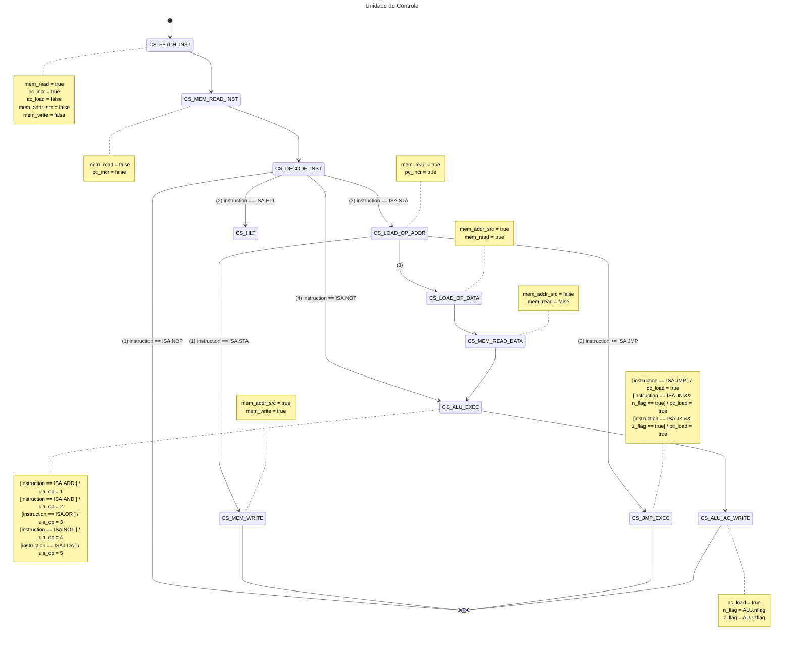

# EMB22109
Trabalho feito em aula (Neander)

```mermaid
---
title: Unidade de Controle
---

stateDiagram-v2
    s0: CS_FETCH_INST

    s1: CS_MEM_READ_INST
    s2: CS_DECODE_INST
    s3: CS_LOAD_OP_ADDR
    s4: CS_LOAD_OP_DATA
    s5: CS_MEM_READ_DATA
    
    s6: CS_MEM_WRITE
    s7: CS_JMP_EXEC
    s8: CS_ALU_AC_WRITE
    s9: CS_ALU_EXEC
    
    s10: CS_HLT

    [*] --> s0
    s0 --> s1
    s1 --> s2

    s2 --> [*] : (1) instruction == ISA.NOP
    s2 --> s10: (2) instruction == ISA.HLT
    s2 --> s3 : (3) instruction == ISA.STA
    s2 --> s9 : (4) instruction == ISA.NOT

    s3 --> s6 : (1) instruction == ISA.STA
    s3 --> s7 : (2) instruction >= ISA.JMP
    s3 --> s4 : (3)

    s4 --> s5
    s5 --> s9

    s6 --> [*]
    s7 --> [*]
    s9 --> s8
    s8 --> [*]

    note right of s0
        mem_read = true
        pc_incr = true
        ac_load = false
        mem_addr_src = false
        mem_write = false
    end note

    note right of s1
        mem_read = false
        pc_incr = false
    end note

    note left of s3
        mem_read = true
        pc_incr = true
    end note

    note left of s4
        mem_addr_src = true
        mem_read = true
    end note

    note left of s5
        mem_addr_src = false
        mem_read = false
    end note

    note left of s6
        mem_addr_src = true
        mem_write = true
    end note

    note left of s7
        [instruction == ISA.JMP ] / pc_load = true
        [instruction == ISA.JN && n_flag == true] / pc_load = true
        [instruction == ISA.JZ && z_flag == true] / pc_load = true
    end note

    note right of s8
        ac_load = true
        n_flag = ALU.nflag
        z_flag = ALU.zflag
    end note

    note right of s9
        [instruction == ISA.ADD ] / ula_op = 1
        [instruction == ISA.AND ] / ula_op = 2
        [instruction == ISA.OR ] / ula_op = 3
        [instruction == ISA.NOT ] / ula_op = 4
        [instruction == ISA.LDA ] / ula_op = 5
    end note

```